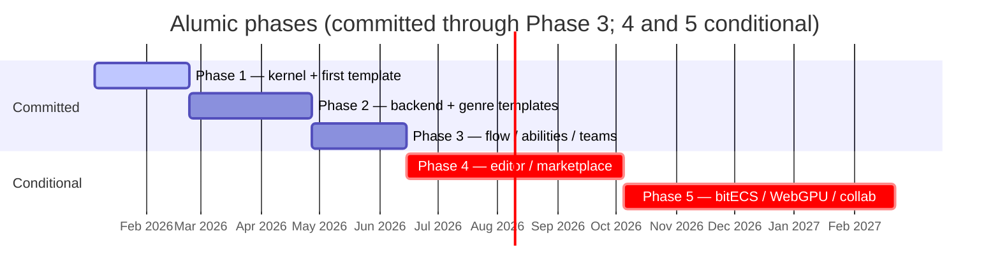

<Info>
**Decisions shaping this page:** [ADR-002 Phase 1 uses an in-memory entity-db shim; backend lands Phase 2](/decisions/002-phase-1-in-memory-shim), [ADR-023 Phases 4 and 5 are conditional on adoption](/decisions/023-phase-4-5-conditional), [ADR-019 ECS FieldType enum is exposed for engine-portable transpilation](/decisions/019-ecs-fieldtype-exposed), [ADR-006 xstate v5 backs @alumic/state; @alumic/flow stays custom](/decisions/006-xstate-plus-custom-flow), [ADR-022 koota adoption deferred until 1.0](/decisions/022-koota-post-1-0), [ADR-016 Constant entity type replaces NumRef](/decisions/016-constant-entity), [ADR-012 Scheduler appends scene-scope systems to end of phase](/decisions/012-scheduler-append-on-push), [ADR-015 Canvas persistence goes through the entity database](/decisions/015-canvas-via-entity-db), [ADR-025 Project identity is a server-issued UUID](/decisions/025-project-identity-server-uuid), [ADR-027 Engine-plugin sync is snapshot + event-stream, server-authoritative](/decisions/027-engine-plugin-sync-protocol), [ADR-003 Authentication and identity phasing](/decisions/003-auth-phasing), [ADR-026 Engine-plugin authentication via workspace-scoped PATs](/decisions/026-engine-plugin-auth), [ADR-030 Schema and protocol version negotiation](/decisions/030-schema-version-negotiation), [ADR-043 Project-management entity types land Phase 3; automation Phase 4](/decisions/043-project-management-phase-3), [ADR-041 Actor model: users and agents as peers](/decisions/041-actor-model), [ADR-042 Proposed writes and approval gates](/decisions/042-proposed-writes-approvals), [ADR-021 Templates and plugins distributed via Alumic marketplace (Phase 4)](/decisions/021-marketplace-phase-4), [ADR-001 SaaS-first, on-prem second](/decisions/001-saas-first)
</Info>

## Overview

This document breaks the Alumic implementation into five phases, with Phase 1 further divided into actionable sub-phases. Each sub-phase has clear deliverables, verification criteria, and a critical path analysis.

## Phase Summary

| Phase | Duration | Focus | Key Deliverable | Committed? |
|-------|----------|-------|----------------|------------|
| **Phase 1** | 6-8 weeks | Kernel + first template + in-memory entity-db shim ([ADR-002 Phase 1 uses an in-memory entity-db shim; backend lands Phase 2](/decisions/002-phase-1-in-memory-shim)) | Running browser app with moving cube | Yes |
| **Phase 2** | 8-10 weeks | Fastify + Postgres backend, JWT auth, assets, state (xstate), save, @alumic/ecs interface | Three genre templates, hosted backend | Yes |
| **Phase 3** | 6-8 weeks | Flow + ability + dialogue + multiplayer + teams + basic canvas | Plugin API stable, four more templates, spatial workspace | Yes |
| **Phase 4** | Ongoing | Editor shell, UI designer, vector editor, full canvas, marketplace, SSO | Visual authoring suite | Conditional on adoption ([ADR-023 Phases 4 and 5 are conditional on adoption](/decisions/023-phase-4-5-conditional)) |
| **Phase 5** | As needed | bitECS, WebGPU, Rust/WASM, real-time collab | Performance + collab tiers | Conditional on demand ([ADR-023 Phases 4 and 5 are conditional on adoption](/decisions/023-phase-4-5-conditional)) |

> **Alumic is considered feature-complete when Phase 3 verification passes.** Phases 4 and 5 are opt-in investments, shipped incrementally based on adoption signal. See [ADR-023 Phases 4 and 5 are conditional on adoption](/decisions/023-phase-4-5-conditional) and Risk Mitigation.



---

## Phase 1: Minimum Viable Framework (6-8 Weeks)

### Critical Path

```
1A: Monorepo Scaffold
 │
 ▼
1B: @alumic/tags
 │
 ▼
1C: @alumic/core (kernel)     ← CRITICAL — everything depends on this
 │
 ├─────────────────┐
 ▼                 ▼
1D: @alumic/render  1E: @alumic/input (stub)
 │
 ▼
1F: @alumic/render-three
 │
 ▼
1G: @alumic/templates-core + first template
```

### Sub-Phase 1A: Monorepo Scaffold (Days 1-2)

**Deliverables:**
- Root `package.json` with Bun workspaces
- `bunfig.toml`
- `tsconfig.base.json` with shared strict TS config
- Root `tsconfig.json` with project references
- `vitest.config.ts`
- `.gitignore`, `.eslintrc.cjs`
- Package directories for all Phase 1 packages with `package.json` and `tsconfig.json`:
  - `packages/tags/`
  - `packages/core/`
  - `packages/render/`
  - `packages/render-three/`
  - `packages/input/`
  - `packages/templates-core/`
- Empty `src/index.ts` in each package
- `CLAUDE.md` with project context

**Verification:**
- `bun install` succeeds
- `tsc -b` passes (empty but valid)
- Cross-package imports resolve via workspace protocol

### Sub-Phase 1B: @alumic/tags (Days 2-4)

**Deliverables:**
- `defineTag(path)` — tag interning with validation
- `matchesTag(pattern, candidate)` — hierarchical prefix matching
- `parentTag(tag)`, `ancestors(tag)`, `depth(tag)` — tag traversal
- `createTagRegistry()` — registry with `register`, `has`, `resolve`, `redirect`, `query`, `all`
- Complete test suite

**Verification:**
- Unit tests: hierarchical matching, interning, ancestor traversal
- Unit tests: redirectors resolve, circular redirect detection
- Unit tests: registry query by prefix
- 100% test coverage

### Sub-Phase 1C: @alumic/core — The Kernel (Days 4-12)

**Deliverables:**
- `types.ts` — `Disposable`, `Scope`, `Id<T>`, `Phase`, `TickContext`
- `channel.ts` — `Observable<T>`, `Channel<T>`, `defineChannel<T>()`, `createEventBus()`
- `scheduler.ts` — `Scheduler`, `defineSystem()`, `createScheduler()`
- `subsystem.ts` — `defineSubsystem<T>()`, `SubsystemHandle<T>`, `SubsystemConfig<T>`
- `plugin.ts` — `AlumicPlugin`, `PluginMeta`, `definePlugin()`, `PluginRegistry`, `createPluginRegistry()`
- `app.ts` — `App` class with full lifecycle (boot, tick, shutdown, scope transitions)
- Built-in channels (`AppBooted`, `SessionStarted`, `SceneEntered`, etc.)
- Complete test suite

**Verification:**
- Unit tests: Observable subscribe/emit/dispose
- Unit tests: EventBus hierarchical dispatch via tags
- Unit tests: Scheduler three-phase execution order
- Unit tests: defineSubsystem scope lifecycle (init on enter, deinit on exit)
- Unit tests: PluginRegistry topological sort, circular dependency detection
- Integration test: Boot an App with multiple plugins, verify lifecycle order
- Integration test: Push/pop scenes, verify subsystem init/deinit
- Integration test: Headless mode (no canvas, manual tick)

### Sub-Phase 1D: @alumic/render (Days 10-11)

**Deliverables:**
- `kernel.ts` — `RenderKernel` interface
- `types.ts` — `FrameInfo`, `RenderTarget`, `RenderKernelCaps`
- `index.ts` — barrel exports

**Verification:**
- Types compile and are importable from other packages
- No runtime code — types only

### Sub-Phase 1E: @alumic/input Stub (Days 11-13)

**Deliverables:**
- `defineAction()` — action definition factory
- `defineInputSchema()` — input context factory
- `InputManager` (minimal) — keyboard polling, button/axis state
- `input()` plugin factory
- WASD + Space + Escape bindings for the first template

**Verification:**
- Unit tests: button state (justPressed, pressed, justReleased)
- Unit tests: axis dead zone processing
- Integration test: input polling in PreUpdate phase

### Sub-Phase 1F: @alumic/render-three (Days 12-15)

**Deliverables:**
- `ThreeRenderKernel` implementing `RenderKernel`
- `threeWebGL()` plugin factory
- `RenderSubsystem` — App-scope subsystem
- `Canvas.tsx` — SolidJS component for canvas mounting
- Resize handling via ResizeObserver

**Verification:**
- Unit test: kernel initializes WebGLRenderer with correct options
- Integration test: App with threeWebGL plugin creates canvas, renders blank scene
- Integration test: resize propagates correctly
- Manual: browser shows colored background

### Sub-Phase 1G: Templates Core + First Template (Days 14-20)

**Deliverables:**
- `@alumic/templates-core`:
  - `defineTemplate()` factory
  - `createApp()` helper
- `@alumic/template-topdown-action`:
  - `template.ts` — manifest with threeWebGL + input plugins
  - `AppShell.tsx` — SolidJS app shell
  - `index.tsx` / `index.html` — entry points
  - Scene with:
    - `THREE.BoxGeometry` + `THREE.MeshStandardMaterial` (cube)
    - `THREE.DirectionalLight` + `THREE.AmbientLight`
    - `THREE.PerspectiveCamera` looking down at the cube
  - `movementSystem` — reads WASD input, translates cube in XZ plane
  - Vite dev server configuration

**Verification:**
- `bun dev` opens browser with 3D scene
- WASD moves the cube
- Cube has lighting and shadows
- Window resize works correctly
- `bun run build` produces deployable static bundle
- **Milestone: "bun dev produces a running browser scene with a moving cube"**

---

## Phase 2: First Game Templates (8-10 Weeks)

### Packages

| Package | Description | Priority |
|---------|-------------|----------|
| `@alumic/backend` | Fastify + Postgres entity API, JWT auth, project ownership | High |
| `@alumic/ecs` | Backend-agnostic ECS interface + in-memory reference backend (FieldType exposed — [ADR-019 ECS FieldType enum is exposed for engine-portable transpilation](/decisions/019-ecs-fieldtype-exposed)) | High |
| `@alumic/assets` | Asset definitions + bundle loading | High |
| `@alumic/save` | Chunked serialization + schema versioning | High |
| `@alumic/state` | HSM package wrapping xstate v5 ([ADR-006 xstate v5 backs @alumic/state; @alumic/flow stays custom](/decisions/006-xstate-plus-custom-flow)) | High |
| `@alumic/audio` | App-scope AudioSubsystem owning the AudioContext | Medium |
| `@alumic/input` (full) | Complete input system with gamepad + contexts | Medium |

> `@alumic/ecs-koota` is **deferred until koota reaches 1.0** ([ADR-022 koota adoption deferred until 1.0](/decisions/022-koota-post-1-0)). Phase 2 ships the interface plus an in-memory reference backend; production ECS workloads wait for a stable backend.

### Templates

| Template | Proves |
|----------|--------|
| `topdown-action` (enhanced) | Full combat loop, abilities, state machines |
| `tactics` | Turn-based grid, different input paradigm |
| `narrative` | Dialogue-driven, minimal combat |

### Verification
- Three distinct templates compile and run
- Templates share >80% of their plugin code (proving composability)
- Save/load works across templates
- Asset bundles load/unload with scene transitions

---

## Phase 3: Plugin API Hardening + Canvas Foundation (6-8 Weeks)

Phase 3 widened from the original 4-6 week scope to include the basic canvas renderer (ADR — see [Canvas and Workspace](/reference/canvas-and-workspace) phasing table). The canvas was scheduled into Phase 3 because its persistence and undo primitives are foundational for the Phase 4 editor shell.

### Packages

| Package | Description |
|---------|-------------|
| `@alumic/flow` | Node-graph runtime (FlowGraph interpreter) |
| `@alumic/ability` | GAS-shaped attributes, effects, abilities (uses Constant entity type per [ADR-016 Constant entity type replaces NumRef](/decisions/016-constant-entity)) |
| `@alumic/dialogue` | Timeline/event-driven dialogue runtime |
| `@alumic/multiplayer` | Colyseus Room+Schema wrapper |
| `@alumic/canvas` | Basic infinite canvas (pan, zoom, notes, connections, persistence, undo — [ADR-012 Scheduler appends scene-scope systems to end of phase](/decisions/012-scheduler-append-on-push), [ADR-015 Canvas persistence goes through the entity database](/decisions/015-canvas-via-entity-db)) |
| `@alumic/engine-bridge` | Shared core for engine plugins; per-engine packages `alumic-unity`, `alumic-godot` ([ADR-025 Project identity is a server-issued UUID](/decisions/025-project-identity-server-uuid), [ADR-027 Engine-plugin sync is snapshot + event-stream, server-authoritative](/decisions/027-engine-plugin-sync-protocol), [Engine Plugin](/platform/engine-plugin)) |
| Team features | Invitations, roles (owner/editor/viewer) in `@alumic/backend` ([ADR-003 Authentication and identity phasing](/decisions/003-auth-phasing)) |
| Entity API + SSE | Full REST surface + live-reload channel ([ADR-026 Engine-plugin authentication via workspace-scoped PATs](/decisions/026-engine-plugin-auth), [ADR-030 Schema and protocol version negotiation](/decisions/030-schema-version-negotiation)) |
| `@alumic/pm` | Project management: Issue, Board, Sprint, Milestone, Comment + `board` / `sprint-backlog` / `milestone-timeline` editor surfaces ([ADR-043 Project-management entity types land Phase 3; automation Phase 4](/decisions/043-project-management-phase-3), [Project Management](/reference/project-management)) |
| Actor model | User/Agent peer identity, Agent + AgentRun + ReviewRequest entity types, agent-PAT credentials ([ADR-041 Actor model: users and agents as peers](/decisions/041-actor-model), [Actors and Agents](/reference/actors-and-agents)) |
| Approvals | Proposed writes + entity-level and issue-level approval state machines ([ADR-042 Proposed writes and approval gates](/decisions/042-proposed-writes-approvals)) |

### Deliverables
- Stable `AlumicPlugin` API (no breaking changes after this phase)
- Plugin author guide documentation
- Four additional templates: survival, vehicle, management, rpg-lite
- Published type stubs for all packages
- PM + Actor + Approval layer: Issue/Board/Sprint/Milestone/Comment entity types; agent credentials; proposed-write pipeline committing via the standard PATCH path

### Verification
- A third-party developer can create a plugin using only the published types and documentation
- All seven templates compile and run
- Multiplayer works between two browser tabs
- Agent proposes a write → editor approves → commits as a normal version visible across all clients
- Reverting an AgentRun reverts every write tagged with its run_id

---

## Phase 4: Creative Tools and Editor (Ongoing)

Alumic is a creative tools platform, not just a game engine. Phase 4 delivers the visual authoring tools that complement the runtime framework.

### Packages

| Package | Description |
|---------|-------------|
| `@alumic/editor-core` | Multi-mode SolidJS application shell (mode switching, panels, commands) |
| `@alumic/editor-scene` | Scene tree + property inspector panels |
| `@alumic/editor-graph` | Visual node-graph editor for dialogue, quests, flow (substrate: `@xyflow/react` or in-house equivalent evaluated in Phase 3) |
| `@alumic/editor-assets` | Asset browser with preview |
| `@alumic/ui-designer` | WYSIWYG UI layout designer (Yoga-based) |
| `@alumic/ui-runtime` | Yoga layout runtime — renders `.ui.json` as SolidJS components |
| `@alumic/vector-editor` | Standalone vector design tool (SVG icons, sprites, UI assets) |
| `@alumic/canvas` (full) | Canvas with level portals, graph refs, design frames, asset boards (basic renderer already shipped in Phase 3) |
| `@alumic/marketplace` | Template + plugin registry backend, publish/install/moderation ([ADR-021 Templates and plugins distributed via Alumic marketplace (Phase 4)](/decisions/021-marketplace-phase-4)) |
| SSO / SAML | On-prem enterprise auth ([ADR-003 Authentication and identity phasing](/decisions/003-auth-phasing)) |

### Deliverables

**Editor Shell:**
- Multi-mode application (Game Viewport, Canvas, UI Designer, Graph Editor, Vector Editor)
- Mode switcher, command palette, panel management
- HMR/`swap()` support for live plugin editing

**Scene Editing:**
- Scene tree with entity selection
- Property inspector for selected entities
- Transform gizmos (translate, rotate, scale)

**Graph Editing:**
- Visual node-and-edge editor for dialogue/quest/flow graphs
- Drag-and-drop node creation from a palette
- Condition editor with variable autocomplete
- Live preview of graph execution

**UI Designer (Visual-First WYSIWYG):**
- Component palette (container, text, image, bar, button, custom)
- Drag-and-drop layout composition on design canvas
- Yoga flexbox property inspector (flex direction, alignment, spacing, sizing)
- Data binding editor (connect UI properties to game state expressions)
- Responsive preview at multiple viewport sizes
- Save to `.ui.json` format — the designer's output IS the runtime format
- UI template ecosystem (pre-built HUD, inventory, dialogue, menu templates)

**Vector Editor:**
- SVG-based drawing tools (pen, shapes, text, boolean operations)
- Icon library management — organize, tag, search, and batch-export icons
- Asset pipeline integration — exports feed into `@alumic/assets` automatically
- Standalone usage — usable as a lightweight vector design tool outside game projects

**Infinite Canvas:**
- Pan, zoom, infinite workspace
- Node types: Level Portals, Document Notes, Asset Boards, Design Frames, Graph References
- Connections between nodes showing relationships
- Level Portals as interactive bookmarks — double-click opens the 3D viewport for that scene
- Canvas document persistence

### Verification
- Editor opens a template project and all modes are functional
- UI Designer exports `.ui.json` that renders identically in the runtime
- Vector editor creates SVG icons that appear in the asset browser
- Infinite canvas persists node layout across sessions
- Level portals navigate to the correct scene in the game viewport
- Dialogue graphs authored in the graph editor play correctly in the runtime

---

## Phase 5: Advanced Backends and Infrastructure (As Needed)

### Packages

| Package | Description |
|---------|-------------|
| `@alumic/ecs-bitecs` | bitECS backend for WebGPU compute |
| `@alumic/render-webgpu` | WebGPU renderer (when Three.js stabilizes) |
| `@alumic/server-wasm` | Rust/WASM server-side game logic |

### Deliverables
- bitECS backend with SharedArrayBuffer worker support
- WebGPU rendering backend
- Rust/WASM build pipeline for performance-critical paths

> The Fastify + Postgres backend, cloud save sync, and leaderboard APIs are **Phase 2** deliverables (see the phase-summary table above and [ADR-001 SaaS-first, on-prem second](/decisions/001-saas-first)). They are not repeated here.

### Verification
- bitECS backend passes same tests as koota backend
- WebGPU renderer produces identical output to WebGL renderer
- Rust/WASM module loads and executes in both browser and server

---

## Risk Mitigation

| Risk | Mitigation |
|------|-----------|
| Three.js breaking changes | Pin version, declare as peer dep with range |
| Colyseus API instability | Wrap in adapter layer, isolate in @alumic/multiplayer |
| koota pre-1.0 churn | **Defer adoption until koota 1.0** ([ADR-022 koota adoption deferred until 1.0](/decisions/022-koota-post-1-0)). Phase 2 ships @alumic/ecs interface + in-memory reference backend only. bitECS is a drop-in replacement if koota stalls. |
| SolidJS breaking changes | Pin version; SolidJS 2.0 is backwards-compatible |
| Scope creep in kernel | Kernel is intentionally minimal. All features are plugins. |
| Plugin API instability | Stabilize by end of Phase 3; document migration path |
| Creative tools bloat | Each tool (vector editor, UI designer, canvas) is a separate package. They can be developed, tested, and shipped independently. |
| Yoga WASM bundle size | Lazy-load Yoga only when UI layouts are used. Tree-shake unused layout features. |
| Phase 4 / Phase 5 over-commitment | Alumic is feature-complete at Phase 3. Phases 4 and 5 ship incrementally based on actual adoption signal ([ADR-023 Phases 4 and 5 are conditional on adoption](/decisions/023-phase-4-5-conditional)), not a fixed roadmap promise. |
| Backend vendor lock-in | Single codebase, config-driven SaaS vs on-prem ([ADR-001 SaaS-first, on-prem second](/decisions/001-saas-first)). Enterprise customers get the same stack as alumic.app via Docker/bun binary. |

## Success Metrics

### Phase 1 Complete When:
- `bun dev` produces a running browser scene with a moving cube
- All core packages build and pass tests
- A developer can write a new plugin against `@alumic/core` types

### Phase 2 Complete When:
- Three distinct game templates run from the same codebase
- Save/load round-trips correctly
- Asset bundle loading is demonstrably faster than loading all assets

### Phase 3 Complete When:
- A third-party developer can build a plugin from documentation alone
- Seven templates cover distinct game genres
- No breaking changes to `AlumicPlugin` are needed

### Phase 4 Complete When:
- A designer can create a complete game HUD using only the UI Designer (no code)
- A level designer can plan and navigate a multi-scene game via the infinite canvas
- Icon assets flow from vector editor to game runtime without manual export steps

### Phase 5 Complete When:

Phase 5 has no single "complete" criterion — each deliverable within it (bitECS backend, WebGPU renderer, Rust/WASM pipelines, real-time collab, authoritative multiplayer) is a distinct opt-in investment with its own "done when" criterion evaluated if and when adoption signal justifies the work. See [ADR-023 Phases 4 and 5 are conditional on adoption](/decisions/023-phase-4-5-conditional).

### Final Goal:
- `bunx @alumic/cli create my-game --template topdown-action && cd my-game && bun dev` produces a running, playable game in under 30 seconds
- A non-programmer can author dialogue, design UI, and create icons using Alumic's visual tools
