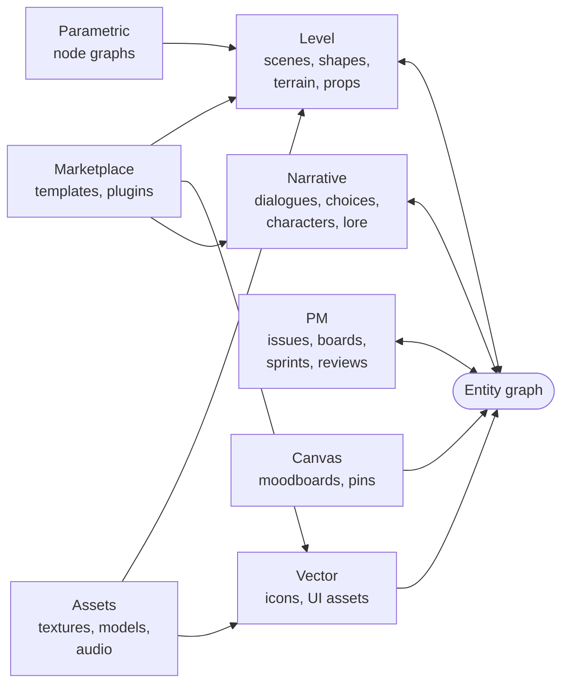

<Info>
**Decisions shaping this page:** [ADR-054 Prototype convergence](/decisions/054-prototype-convergence), [ADR-055 Shell is four-column domain-first](/decisions/055-shell-domain-first), [ADR-018 Entity-type and extractor registration](/decisions/018-entity-registration-api), [ADR-043 Project-management entity types land Phase 3; automation Phase 4](/decisions/043-project-management-phase-3), [ADR-021 Templates and plugins distributed via Alumic marketplace (Phase 4)](/decisions/021-marketplace-phase-4)
</Info>

Alumic has **seven named modes** plus a Home. Each is a view over the same entity graph. The mode changes *what* you see and the viewport-specific toolset; the entities, the inspector, the navigation semantics never change.

## Mode map

| Mode | Prototype backing | What Alumic adds | Primary entities |
|---|---|---|---|
| **Home** | None | Project dashboard, recent activity, presence summary | ProjectMeta, ActivityFeed |
| **Narrative** | `@taleframe/narrative-editor` (structural only) | Dialogue runtime; variable bindings; condition evaluation; character/emotion metadata | Dialogue, Choice, Scene ref, Character ref |
| **Level** | `@taleframe/level-editor` | Runtime play; character controller; genre presets; entity placement binding | Scene, LevelShape, Character placement, Ability |
| **Canvas** (creative) | None (Milanote-shaped, new) | New surface for moodboards, inspo, pinned entities | FreeformNote, EntityPin, AssetPin, Connection |
| **Vector** | `@taleframe/core` (mature) | Entity binding — vector assets as authored entities with backlinks | VectorAsset, IconSet |
| **Parametric** | `@gantry/kernel` + `@gantry/three` (geonode-engine) | Translation from `GeneratedMesh` → `LevelShape`; entity-typed node categories | NodeGraph, GeneratedMesh, ProceduralPreset |
| **UI** | None | Marketplace-template modification (not from-scratch Yoga designer) | UILayout, UIBinding |
| **PM** | None | Issues, boards, sprints, proposals (HacknPlan-shaped) | Issue, Board, Sprint, Comment, ReviewRequest |
| **Assets** | `@taleframe/dam` | Team sync; search; tag conventions | Asset, Collection |
| **Marketplace** | None | Browse, install, publish templates / plugins / bundles | MarketplaceListing, InstallReceipt |

Two modes (Marketplace, PM) are tied to later phases — see [ADR-021](/decisions/021-marketplace-phase-4) and [ADR-043](/decisions/043-project-management-phase-3). The shell shows them siderail-gated with a phase lock until they ship.

## The closed loop

Narrative and Level are the wedge. PM is the orbit they run in. Parametric feeds Level. Canvas and Vector feed both. Assets and Marketplace are utilities.

Every arrow into the entity graph is bidirectional — modes both read and write entity rows. Cross-mode arrows (Parametric → Level, Assets → Level / Vector) describe where a mode's output is consumed by another mode without going through the shared entity graph first.

## Narrative

**Backed by** `@taleframe/narrative-editor` — structural graph editor with story-arc / scene / dialogue / choice / symbol node types, ports, groups, LOD zoom, Canvas2D rendering with rbush spatial index.

**Alumic adds:**
- **Dialogue runtime** — the narrative editor today is read-only structurally. Alumic ships a runtime that evaluates a dialogue graph against a variable context, producing `LinePresented` / `ChoicesPresented` / `ChoiceMade` / `DialogueEnded` events.
- **Variable bindings** — dotted paths (`player.level`, `quest.tutorial.completed`) resolve through a shared `VariableRegistry` ([ADR-017 Shared VariableRegistry in @alumic/core](/decisions/017-shared-variable-registry)).
- **Condition evaluation** — edges carry structured conditions (no `eval`), checked at runtime to gate choices.
- **Character / emotion / audio metadata** — dialogue nodes extend the base schema with speaker (entity ref), emotion tag, audio-clip asset reference.

**Entities surfaced:** Dialogue, Choice, Character (referenced from dialogue nodes' `speaker`), Scene (referenced from dialogue `location`), Lore (referenced from `mentions`).

**Example handoff:** Click a speaker chip on a dialogue node → focuses the Character in the inspector. `Ctrl+click` opens the character sheet full-screen. `Cmd+Enter` on a Dialogue entity → jumps to the Level mode with the scene bound to that dialogue loaded, camera focused on the speaker.

## Level

**Backed by** `@taleframe/level-editor` — split-pane 2D plan view + 3D scene view, unified Solid store. Ships today with: CSG via `three-bvh-csg`, terrain painting with height falloff, floor-layer stacking, reference images, shape library, material system, grid snap, dimension rendering, rbush spatial index.

**Alumic adds:**
- **Character controller** — first-person, third-person, orbit, orthographic presets. None exist in taleframe today; they are new.
- **Genre presets** — "FPS arena", "RTS skirmish", "third-person dialogue room", "2D platformer section". Each preset is a bundle: camera + controller + grid snap + starter entity library.
- **Runtime play** — press Play → the level loads into a running game context with the configured controller; Esc returns to edit.
- **Entity placement binding** — placing a Character entity in a scene creates an entity reference (scene → character with role `placement` and context `{x, y, z}`), not a copy. Renaming the character propagates; the placement carries no stale data.

**Entities surfaced:** Scene, LevelShape (prop / terrain / reference-image), CharacterPlacement, Material, FloorLayer, Ability (wired to placed characters).

**Example handoff:** Right-click a placed character → "Go to narrative" opens the Narrative mode with that character's primary dialogue focused. The breadcrumb reads `Narratives › intro.graph`; the inspector remembers the scene as "recently focused."

## Canvas (creative)

**Backed by** none — new surface in Alumic. Milanote-shaped: an infinite spatial workspace where users pin moodboard imagery, sketch early notes, arrange inspo, and connect entity references.

**Alumic adds:**
- **FreeformNote** — simple sticky-note style text blocks with color.
- **EntityPin** — drag any entity from another mode onto the canvas to create a spatial pin that links to the live entity. The pin renders a thumbnail or summary card appropriate to the entity type.
- **AssetPin** — inline image / video / audio embeds from the DAM.
- **Connection** — edges between pins or notes, with optional labels, showing relationships ("this character appears in this scene", "this dialogue plays in this level").

**Entities surfaced:** CanvasBoard (the workspace itself, [ADR-015 Canvas persistence goes through the entity database](/decisions/015-canvas-via-entity-db)), FreeformNote, EntityPin (reference), AssetPin (reference), Connection.

**Example handoff:** A user drops a Character pin on the canvas → right-click → "Open narrative" opens the Narrative mode with the character's primary dialogue focused. "Open level placements" opens the Level mode filtered to scenes where the character appears.

## Vector

**Backed by** `@taleframe/core` — production-ready Canvas2D vector editor. Shapes (Rect, Ellipse, Path, Text, Frame), path editing, typography, fills / strokes, boolean operations via Rust/WASM geo, SVG / PNG export, `CartaEditor` + `SubsystemRegistry` + `CommandManager`.

**Alumic adds:**
- **Entity binding** — vector assets become authored entities with IDs, tags, and backlinks. A used-in panel shows where each asset is referenced.
- **Token-aware styling** — fills, strokes, and typography can bind to design-system tokens rather than literal values, so marketplace UI templates adapt to project themes.

**Entities surfaced:** VectorAsset, IconSet (a grouped collection).

**Example handoff:** An IconSet asset used by three UILayouts shows all three in its inspector's "Used by." Clicking any jumps into the UI mode with that layout focused.

## Parametric

**Backed by** `@gantry/kernel` + `@gantry/three` (geonode-engine) — production-grade parametric node graph with 82 node definitions (kernel primitives, mesh ops, curves, instancing, flow, math, mannequin, clothing). Pull-based lazy evaluator with cycle detection and result caching. DOM-based visual editor with SVG wires. 50 built-in graph presets.

**Alumic adds:**
- **Entity-typed node categories** — a new "Alumic" category wrapping entity-graph reads. A node like "Get Character" takes an entity ID, returns a placement-ready descriptor with position / rotation / scale.
- **Procedural preset as entity** — authored graphs become `ProceduralPreset` entities. Dragging one into the level editor instantiates it as a reusable `LevelShape` prop.
- **Translation layer** — geonode outputs `GeneratedMesh` typed arrays; the level editor consumes `LevelShape`. A named adapter converts between them, preserving entity identity for round-trips.

**Entities surfaced:** NodeGraph, ProceduralPreset, GeneratedMesh (transient runtime representation).

<Warning>
**The geonode↔level-editor integration is a Phase-2 task, not a shipping feature today.** Geonode-engine outputs raw indexed triangle buffers (`GeneratedMesh`); the level editor's scene format uses typed `LevelShape` primitives with CSG ops routed through `three-bvh-csg`. Bridging them requires an adapter that preserves entity identity so that regenerating a parametric graph updates the level-editor instance without breaking backlinks. This adapter is named explicitly in [ADR-054](/decisions/054-prototype-convergence) as a named design-spec concern. The bridge design lives in a follow-up spec chapter (pending); until it lands, the Parametric and Level modes are separate surfaces with no live binding.
</Warning>

**Example handoff (target state):** Author a "forest-hut" parametric graph → save as `ProceduralPreset` → drag into a level scene → becomes a `LevelShape` prop with the graph as its backing. Tuning the graph regenerates the placement without breaking other references.

## UI

**Backed by** none — new surface in Alumic. Per [Principle 5 — Marketplace over bespoke](/design/principles#5-marketplace-over-bespoke), the UI mode is a template-modification surface, not a from-scratch Yoga WYSIWYG designer.

**Alumic adds:**
- **Template picker** — marketplace-sourced UI layouts ("HUD minimal", "HUD RPG", "Inventory grid", "Dialogue standard", "Main menu").
- **Binding inspector** — each template exposes named binding slots (`fillPercent`, `label`, `visible`). User binds slots to shared variable paths (`player.health`, `player.maxMana`).
- **Live preview** — the binding preview runs against mock data, with optional project-context live data once a playable level is available.

**Entities surfaced:** UILayout, UIBinding.

**Example handoff:** Pick a HUD template → bind `fillPercent` to `player.health / player.maxHealth` → done. No from-scratch authoring required. Vector assets referenced by the template come from the same marketplace, same entity graph.

## PM

**Backed by** none — new surface in Alumic per [ADR-043 Project-management entity types land Phase 3; automation Phase 4](/decisions/043-project-management-phase-3). HacknPlan-shaped.

**Alumic adds:**
- **Issue, Board, Sprint, Milestone, Comment, ReviewRequest** — all entity types with full backlinks, search, and inspector integration.
- **Kanban, sprint-backlog, milestone-timeline editor surfaces** — registered via the standard `ctx.editors.register()` surface ([ADR-018](/decisions/018-entity-registration-api)).
- **Linked-entity refs** — an Issue can reference any entity in any domain. Completing an Issue tied to an Ability auto-closes on the Ability's review merge.

**Entities surfaced:** Issue, Board, Sprint, Milestone, Comment, ReviewRequest.

**Example handoff:** An Issue referencing a Dialogue → clicking the dialogue chip in the issue inspector jumps to Narrative mode with that dialogue focused. Conversely, the Dialogue's inspector shows the Issue under "Used by" with its status.

## Assets

**Backed by** `@taleframe/dam` — local-first DAM with IDB and File System Access API storage, asset metadata, collection tree, thumbnail generation, hashing.

**Alumic adds:**
- **Team sync** — assets become entities synced through the standard entity API ([ADR-029 Binary assets are object-storage blobs with signed URLs](/decisions/029-assets-object-storage)). Local IDB becomes an offline mirror.
- **Search + tag conventions** — project-wide asset search, hierarchical tag filtering.

**Entities surfaced:** Asset, Collection.

## Marketplace

**Backed by** none — new surface in Alumic. See [ADR-021 Templates and plugins distributed via Alumic marketplace (Phase 4)](/decisions/021-marketplace-phase-4), [ADR-039 Templates ship seed content under data/entities/ + data/assets/](/decisions/039-template-seed-format), [ADR-048 Template install seeds entities and rewrites refs server-side](/decisions/048-template-install-seed).

**Alumic adds:** Template browsing, plugin browsing, genre-bundle browsing, one-click install, publish flow with signing and entity rewriting, cross-workspace import ([ADR-045](/decisions/045-cross-workspace-import)).

**Entities surfaced:** MarketplaceListing, InstallReceipt, PublishReceipt.

## Cross-mode handoff patterns

Three idioms for moving between modes:

1. **Open the related entity** — the inspector's "Used by" and "References" sections name every cross-domain link. One click jumps.
2. **Command palette** — `Cmd+K` + entity name + Enter. The palette routes to the right domain automatically.
3. **Mode-specific "go to"** — each mode adds contextual "go to X" menu items on entity chips (right-click speaker chip → "Go to character sheet"). These are shortcuts over idioms 1 and 2 — the underlying mechanism is the same.

The three idioms are redundant on purpose (see [Shell → Entity-graph discoverability](/design/shell#entity-graph-discoverability)). Different users reach for different affordances; the product respects all three.
