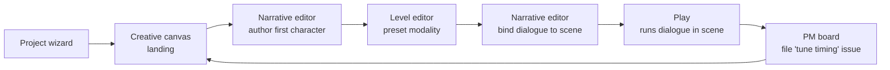

<Info>
**Decisions shaping this page:** [ADR-025 Project identity is a server-issued UUID](/decisions/025-project-identity-server-uuid), [ADR-048 Template install seeds entities and rewrites refs server-side](/decisions/048-template-install-seed), [ADR-054 Prototype convergence](/decisions/054-prototype-convergence), [ADR-055 Shell is four-column domain-first](/decisions/055-shell-domain-first)
</Info>

The onboarding flow is the product in miniature. It exercises every load-bearing surface — the creative canvas, the narrative editor, the level editor with its genre-preset character controller — and it demonstrates the closed loop in the user's first session. It is the demo; it is also the real workflow.

## The flow at a glance

Five steps, one loop. The user ends the session with: a created project, a starter scene populated with genre-appropriate entities, a first dialogue running in that scene, and a PM ticket tracking their next iteration. That is the same playbook in practice.

## Step by step

<Steps>
  <Step title="Project creation wizard">
    User clicks **New project**. The wizard asks two things: a **project name** and a **genre**.

    Genre options (Phase 2 initial set):
    - **FPS** — first-person controller, free-look camera, jump + sprint, hitscan + projectile weapon stub, WSAD + mouse bindings, "arena" starter scene.
    - **RTS** — orthographic camera with pan/zoom, grid-snap build system, unit-placement tool, click-to-move, "skirmish" starter scene.
    - **Third-person action** — orbit camera, root-motion character, dialogue-trigger volumes, "dialogue room" starter scene.
    - **Top-down** — fixed-angle orthographic, WSAD movement, interact button, "tavern" starter scene.
    - **2D platformer** — side-scroll camera, run + jump + wall-slide, physics volumes, "first level" starter scene.
    - **Narrative-only** — no controller, camera fixed on dialogue UI, "conversation stage" starter scene.

    Genre selection picks a **preset bundle**: camera + controller + build system + starter scene + starter entity library (at minimum, a protagonist character with default abilities and a named scene they spawn in).

    Under the hood: the wizard invokes the marketplace install flow ([ADR-048](/decisions/048-template-install-seed)) to seed the project with the chosen genre bundle's entities. A server-issued UUID ([ADR-025](/decisions/025-project-identity-server-uuid)) is minted on creation.

    **Outcome:** a brand-new project with a protagonist entity, a starter scene, a configured character controller, and a corresponding PM board initialized with a "first playable" milestone.
  </Step>
  <Step title="Land on the creative canvas">
    The user doesn't land in the level editor. They land in **Canvas (creative)** on a blank board titled "project-name • planning". The secondary panel shows one board; the viewport is empty except for a subtle prompt: *drop inspo, sketch notes, pin your protagonist*.

    The protagonist entity and the starter scene entity are already pinned in a "starter" group in the board's corner, ready to explore.

    The user:
    - Drops reference imagery (drag from file system into the DAM, then onto the canvas).
    - Writes freeform notes about tone, beats, mechanics.
    - Pins additional entity types — planned characters, planned scenes, planned abilities — even before authoring them properly.

    No forced tutorial. No modal. The canvas is the quiet planning surface the user works from.
  </Step>
  <Step title="Jump to narrative editor — author the first character">
    User clicks the protagonist pin on the canvas → right-click → **Open character sheet**, or selects and presses `Enter`. The shell switches to **Narrative** mode; the secondary panel shows all characters (just the protagonist so far); the viewport opens the protagonist's spec sheet.

    They fill in name, role, backstory (as free-form markdown or by referencing a Lore entity). They click **New dialogue** — a blank dialogue graph opens in a new tab, with the protagonist already set as the default speaker.

    They author a short dialogue: two lines, one choice, two branches. They save; validation passes.
  </Step>
  <Step title="Jump to level editor with preset modality">
    User switches siderail to **Level**. The secondary panel shows the starter scene. Opening it loads the preset modality:

    - **FPS:** first-person controller spawned, physics on, gravity enabled. Click-to-place prop palette on a toolbar.
    - **RTS:** orthographic camera pans with middle-mouse, build grid visible, unit-placement tool active.
    - **Third-person:** orbit camera framing the protagonist, dialogue-trigger volume visual overlay.
    - **Top-down:** fixed angle, grid snap active, interaction-volume overlay.
    - **2D platformer:** side-scroll camera, physics on, run-jump-wallslide debug overlay.

    The user pulls in props from the DAM, sculpts terrain with the brush, paints floor materials. They drop the protagonist entity into the scene — it becomes a `CharacterPlacement` referencing the protagonist entity.

    Under the hood: placements use entity refs, not copies. Renaming the protagonist later propagates ([Principles → Author-once, reuse-everywhere](/design/principles#4-author-once-reuse-everywhere)).
  </Step>
  <Step title="Bind the dialogue to the scene, press Play">
    User switches back to **Narrative**, opens their dialogue, clicks the **Scene** field in the inspector → picks the starter scene. The dialogue is now bound.

    User presses **Play** (or `Cmd+Enter` on the dialogue entity). The shell switches to **Level**, the scene loads with the configured controller, the dialogue begins presenting in-scene. The user advances lines, picks a choice, sees the branch play out.

    **The loop has closed.** The first round-trip from authoring to play happened inside the product with no external tools, no compile step, no manual wiring.
  </Step>
  <Step title="Open a PM issue from inside the scene">
    User notices the dialogue advances too fast for the player's reading speed. While still in the Level scene with the play overlay visible, they right-click the active dialogue node → **File issue**. A pre-filled issue form appears referencing the dialogue entity. They add a title (*"Tune auto-advance timing on intro dialogue"*), assign themselves, pick the Phase-2-polish milestone, submit.

    The siderail **PM** icon shows a fresh-activity dot. Opening PM mode shows the issue on their default board's *Open* column, already linked to the dialogue and the scene. Their first sprint has its first real ticket.

    **Onboarding ends here.** The user has exercised Narrative + Level + Canvas + PM + the entity graph, and the project has momentum.
  </Step>
</Steps>

## Entities touched in the flow

| Step | Mode | Entities authored or referenced |
|---|---|---|
| 1 | — | ProjectMeta (minted), Character (protagonist seed), Scene (starter), Ability (starter), Milestone ("first playable") |
| 2 | Canvas | CanvasBoard (planning), FreeformNote, EntityPin (× protagonist, × starter scene), AssetPin (reference imagery) |
| 3 | Narrative | Character (edited), Lore (optional), Dialogue (new) |
| 4 | Level | Scene (edited), LevelShape (props + terrain), CharacterPlacement (× protagonist) |
| 5 | Narrative ↔ Level | Dialogue (updated with scene ref), Scene (referenced) |
| 6 | Play | (runtime only — no new entities) |
| 7 | PM | Issue (new), Comment (optional), linked to Dialogue + Scene |

Every step adds at least one entity to the graph. By the end, the project already has ~8 interlinked entities across 4 domains — which crosses the "entities referenced from ≥3 modes" success signal from [Vision](/design/vision#success-signals) in a single session.

## Pacing

The target for the whole flow on a fresh account:
- **Project creation wizard** — under 60s.
- **Canvas landing** — 1–5 minutes, user-pacing.
- **First character authored** — 2 minutes.
- **First dialogue authored** — 3–5 minutes.
- **Level populated + controller felt** — 3 minutes.
- **Play loop** — under 60s (bind + play).
- **First issue filed** — 30s.

End-to-end, a user who moves at a normal pace has a playable level with a working dialogue and their first PM ticket **under 15 minutes**. That number is the product's north-star for time-to-closed-loop.

## Design notes for the wizard

- **Genre selection is not a role selection.** Per [Principle 7 — Generalist-first](/design/principles#7-generalist-first), users pick genre, not profession. The product does not ask "are you a writer or a level designer?"
- **Genre is mutable.** A user who picked FPS can later change to top-down without re-creating the project. Genre swap re-seeds controller + camera + starter scene hints but preserves authored entities.
- **The canvas is the landing, not the wizard's final screen.** Dropping the user into Canvas rather than Level signals that Alumic is a planning-and-play surface, not just a level editor.
- **No tutorial modal overlays.** Every affordance is reachable via its normal shell controls. The prompt on the blank canvas is a quiet copy cue, not a guided tour.
