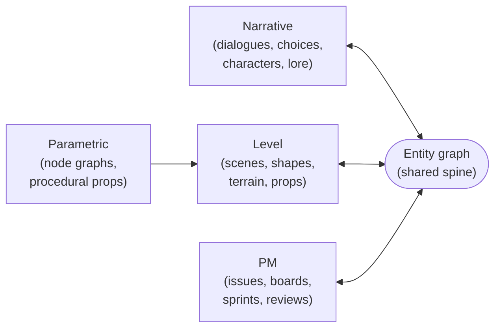

<Info>
**Decisions shaping this page:** [ADR-054 Alumic converges taleframe and geonode-engine as co-foundations](/decisions/054-prototype-convergence), [ADR-001 SaaS-first, on-prem second](/decisions/001-saas-first), [ADR-023 Phases 4 and 5 are conditional on adoption](/decisions/023-phase-4-5-conditional), [ADR-043 Project-management entity types land Phase 3; automation Phase 4](/decisions/043-project-management-phase-3)
</Info>

## Alumic converges

- **Taleframe** — vector canvas, level editor, narrative graph editor, local-first DAM. SolidJS + Kobalte + Tailwind + Canvas2D + Three.js + Rust/WASM. Shipping today as the working creative-tooling foundation.
- **geonode-engine** — parametric level tooling, Blender geometry-nodes-class. 82 nodes across 14 categories, renderer-independent pure-TS kernel, 358 passing tests. Shipping today as the parametric authoring foundation.
- **New** — entity graph, dialogue runtime, team/workspace model, genre-preset onboarding, marketplace, PM mode. The glue that makes the prototypes one product.

…into one playbook for small studios.

## The closed loop

Narrative design and level / game design are one workflow, not two tabs. In Alumic:

- A character authored in the narrative editor appears, unchanged, in the level editor as a placeable entity.
- A scene blocked out in the level editor becomes the binding target for a dialogue that plays **in situ**.
- An issue opened against a dialogue in the narrative editor surfaces on the PM board, linked to the Scene it tests.
- A parametric building graph authored in the geonode-powered parametric mode becomes a reusable prop in the level editor, versioned as an entity.

Every mode is a view over the same entity graph. The mode changes **what** you see; the entities never change.

## Competitive frame

Alumic's reference points are Articy:Draft, Milanote, Arcweave, and HacknPlan — not Figma, not Unity. Small studios today use those four tools in parallel, tab-switching between them. Alumic is the collapse of that set into one surface tied by the entity graph.

<CardGroup cols={2}>
  <Card title="Articy:Draft × Arcweave" icon="comments">
    Narrative graph authoring — dialogues, quests, character sheets, lore, cross-references. Alumic matches what these do and adds engine integration.
  </Card>
  <Card title="Milanote" icon="clipboard">
    Spatial creative workspace for moodboards, inspo, pinned media, and plan-in-progress. Alumic's creative canvas is the Milanote-shaped mode.
  </Card>
  <Card title="HacknPlan" icon="clipboard-list">
    Game-dev-specific project management: tasks tied to design docs, milestones, sprints. Alumic's PM mode is HacknPlan-shaped, with entity-graph integration out of the box.
  </Card>
  <Card title="Taleframe × geonode" icon="cubes">
    The creative and parametric level tooling Alumic already owns. This is the differentiator: no competitor in the narrative/PM space ships actual in-browser 3D level blockout.
  </Card>
</CardGroup>

What's **not** in the frame: Figma-for-games, Unity-lite, Roblox-Studio-alternative. Engine integrations (Unity / Unreal / Godot transpile) are Phase 4+ and are not part of the year-one wedge.

## Primary user

The **generalist developer at a small studio** (3–15 people) wearing five hats. They design combat one day, write dialogue the next, paint terrain the third, close a sprint ticket the fourth, kitbash a building graph the fifth. They do not have a dedicated narrative team, a dedicated combat systems team, or a dedicated UI designer. They have themselves and one or two colleagues.

The product promise to them is **the same playbook**. One entity graph across every mode. One inspector schema. One search. One review flow. Zero drift between what "the hermit" means in the narrative editor, in the level editor, and on the board.

## Success signals

- **Time-to-first-playable-level** — from `alumic create` to walking around in a scene. Target: under five minutes on a fresh account.
- **Time-to-first-dialogue-branch** — from opening the narrative editor to having a bound, playable dialogue tree. Target: under ten minutes.
- **Entities referenced from ≥3 modes** — the key integration metric. If a Character entity is authored in the narrative editor but only ever appears there, the wedge isn't landing. Target: median authored entity is referenced by the narrative editor + the level editor + the PM board within the first week.
- **Multi-hat activity per user per week** — count distinct domains a user touches in a given week. Target: active users touch ≥4 modes per week (a narrative-only user is not a match for the product; they'd be better served by Arcweave alone).
- **Template re-use rate** — marketplace templates installed per project. Target: the median project uses ≥2 marketplace templates (UI, level blockout preset, dialogue template, or genre bundle).

## What Alumic is not

- Not a general-purpose game engine. No physics engine, animation system, scene graph. Three.js is the substrate.
- Not Figma. The vector editor is production-ready, but Alumic is for game development, not graphic design.
- Not Unity-lite. The runtime is in-browser and aimed at small-to-mid experiences. Engine integration for AAA scope is not the product.
- Not a narrative-only tool. A studio using Alumic exclusively for dialogue without level blockout or PM is under-using the product; Arcweave is a better fit for that user.
- Not a private silo. The "same playbook" promise is about team activity across modes; solo-only workflows are supported but not optimized for.
