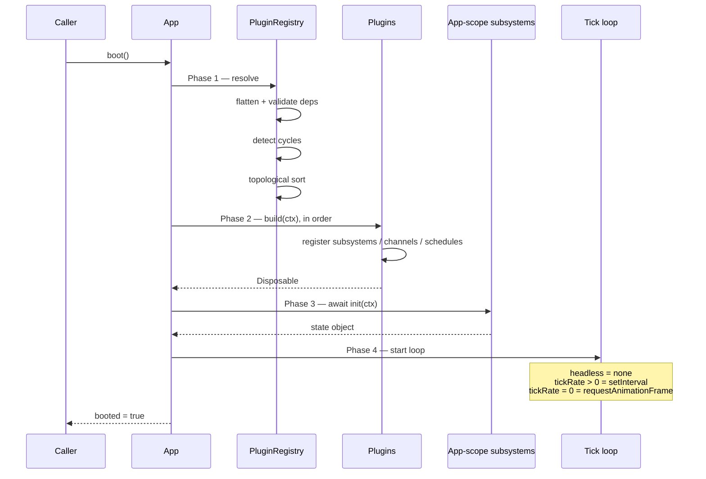

<Info>
**Decisions shaping this page:** [ADR-018 Entity-type and extractor registration via ctx.entities](/decisions/018-entity-registration-api), [ADR-017 Shared VariableRegistry in @alumic/core](/decisions/017-shared-variable-registry), [ADR-010 Subsystem init() failure is fail-fast](/decisions/010-init-failure-fail-fast), [ADR-003 Authentication and identity phasing](/decisions/003-auth-phasing), [ADR-025 Project identity is a server-issued UUID](/decisions/025-project-identity-server-uuid), [ADR-002 Phase 1 uses an in-memory entity-db shim; backend lands Phase 2](/decisions/002-phase-1-in-memory-shim)
</Info>

## Overview

The `App` class is the root of an Alumic application. It owns the kernel primitives (event bus, scheduler, plugin registry, subsystem hierarchy) and manages the full application lifecycle from boot through tick loop to shutdown.

## The App Class

```typescript
export interface AppConfig {
  /** Plugins to install. Order matters only for plugins without explicit dependencies. */
  plugins: Array<AlumicPlugin | AlumicPlugin[]>;

  /**
   * Target ticks per second for fixed-step simulation.
   * 0 = run as fast as requestAnimationFrame allows (default).
   * Useful for deterministic gameplay (e.g., 60 TPS for physics).
   */
  tickRate?: number;

  /**
   * If true, do not request a canvas or animation frame.
   * Useful for testing or server-side usage.
   */
  headless?: boolean;
}

export declare class App {
  constructor(config: AppConfig);

  /** Boot: sort plugins, build, init App-scope subsystems, start loop. */
  boot(): Promise<void>;

  /** Run one tick manually. Used in tests or custom loops. */
  tick(dt: number): void;

  /** Shutdown: stop loop, deinit all subsystems, dispose all plugins. */
  shutdown(): void;

  /** The AppContext available to plugins and subsystems. */
  readonly ctx: AppContext;

  /** True after boot() resolves, false after shutdown(). */
  readonly booted: boolean;

  /** True while the tick loop is running. */
  readonly running: boolean;

  // ── Scope Transitions ──

  /** Start a session. Inits Session-scope subsystems. */
  startSession(sessionId?: string): void;

  /** End the current session. Deinits Session-scope subsystems. */
  endSession(): void;

  /** Push a scene onto the scene stack. Inits Scene-scope subsystems. */
  pushScene(sceneId: string, data?: unknown): void;

  /** Pop the current scene. Deinits its Scene-scope subsystems. */
  popScene(): void;

  /** Replace the current scene (pop + push in one call). */
  replaceScene(sceneId: string, data?: unknown): void;

  /** Add a player. Inits Player-scope subsystems for this player. */
  addPlayer(playerId: string): void;

  /** Remove a player. Deinits their Player-scope subsystems. */
  removePlayer(playerId: string): void;

  // ── Resource Management ──

  /** Insert an arbitrary typed resource accessible via getResource(). */
  insertResource<T extends object>(resource: T): void;

  /** Retrieve a resource by its constructor type. */
  getResource<T extends object>(ctor: new (...args: any[]) => T): T;
}
```

## AppContext

The `AppContext` is the interface that plugins and subsystems use to interact with the kernel. It is passed to every `plugin.build(ctx)` call and available via `app.ctx`.

```typescript
export interface AppContext {
  /** The event bus. */
  readonly bus: EventBus;

  /** The scheduler. */
  readonly scheduler: Scheduler;

  /** The tag registry. */
  readonly tags: TagRegistry;

  /** Entity graph registration surface (see [Entity Graph](/reference/entity-graph) and [ADR-018 Entity-type and extractor registration via ctx.entities](/decisions/018-entity-registration-api)). */
  readonly entities: EntityContext;

  /** Editor surface registration (see [Navigation and Shell](/reference/navigation-shell) and [ADR-018 Entity-type and extractor registration via ctx.entities](/decisions/018-entity-registration-api)). */
  readonly editors: EditorContext;

  /** Shared variable registry for flow/UI/dialogue paths (see [State Machines](/reference/state-machines), [UI Integration](/reference/ui-integration), [ADR-017 Shared VariableRegistry in @alumic/core](/decisions/017-shared-variable-registry)). */
  readonly variables: VariableRegistry;

  /**
   * Declare a subsystem. The kernel will init it when its scope is entered.
   * Must be called during plugin.build().
   */
  subsystem<T>(handle: SubsystemHandle<T>): void;

  /**
   * Retrieve a subsystem's current state.
   * Throws if the subsystem's scope is not currently active.
   * Also throws if called during another subsystem's init() before the target
   * has initialized — this detects cross-subsystem init cycles.
   */
  get<T>(handle: SubsystemHandle<T>): T;

  /**
   * Shorthand: schedule a system function at a given phase.
   * Returns a Disposable to unregister.
   */
  schedule(phase: Phase, fn: SystemFn, label?: string): Disposable;

  /**
   * Insert a typed resource (non-scoped singleton).
   * Resources are available immediately after insertion.
   * Shares a single backing table with App.insertResource / App.getResource —
   * ctx.insertResource(x) followed by app.getResource(X) returns the same instance.
   */
  insertResource<T extends object>(resource: T): void;

  /**
   * Retrieve a resource by constructor type.
   * Throws if not found.
   */
  getResource<T extends object>(ctor: new (...args: any[]) => T): T;
}

// ── Registration surfaces on AppContext ──

export interface EntityContext {
  /** Register a custom entity type. Throws on duplicate type name. */
  registerType(type: EntityType<any>): Disposable;

  /**
   * Register a reference extractor for a given entity type.
   * The extractor walks entity.data and returns outbound EntityRef[].
   * Throws if a second extractor is registered for the same type name.
   */
  registerExtractor<T>(typeName: string, extractor: RefExtractor<T>): Disposable;
}

export interface EditorContext {
  /**
   * Register an editor surface for one or more entity types.
   * Throws if two surfaces claim the same entity type.
   */
  register(surface: EditorSurface): Disposable;
}
```

## Boot Sequence

`App.boot()` is async to support subsystems that require async initialization (loading assets, initializing WebGPU, etc.).



### Initialization Failure

If any `init()` during boot (App-scope) or scope entry (`startSession`, `pushScene`, `addPlayer`) rejects or throws:

1. The error is emitted on the `PluginError` channel (`App.Error.Plugin`) with the failing subsystem's name.
2. Already-initialized sibling subsystems are **torn down in reverse registration order** — their `deinit()` is called so no resources leak.
3. The offending `boot()` / scope-transition call rejects with an `InitError` wrapping the original.

The caller sees a rejected promise; at that point nothing is running and it is safe to retry with different config or fall back to headless mode. Plugins must make their `deinit()` safe to call on a partially-initialized state (a subsystem whose `init()` threw halfway). See [ADR-010 Subsystem init() failure is fail-fast](/decisions/010-init-failure-fail-fast).

### Why boot() Is Async

Some subsystems need async initialization:
- `ThreeRenderKernel` may need to initialize a WebGPU device
- Asset subsystems may preload critical assets
- Audio subsystems may initialize the AudioContext (requires user interaction)

The `SubsystemConfig.init()` return type is `T | Promise<T>`. The kernel `await`s all App-scope inits during boot. After boot completes, `ctx.get()` always returns `T` synchronously — no async in the hot path.

## Tick Loop

Each frame, the App executes one tick:

```
app.tick(dt)
│
├── 1. Compute TickContext
│   └── { dt, elapsed, frame }
│
├── 2. Tick App-scope subsystems (those with tick() methods)
│
├── 3. Tick Session-scope subsystems (if session active)
│
├── 4. Tick Scene-scope subsystems (if scene active)
│
├── 5. Tick Player-scope subsystems (for each active player)
│
├── 6. Run Scheduler
│   ├── Phase.PreUpdate — all systems registered at this phase
│   ├── Phase.Update — all systems registered at this phase
│   └── Phase.PostUpdate — all systems registered at this phase
│
└── 7. frame++
```

### TickContext

```typescript
export interface TickContext {
  /** Seconds since last tick. Clamped to avoid spiral of death. */
  readonly dt: number;

  /** Total elapsed seconds since App.boot(). */
  readonly elapsed: number;

  /** Current frame number (monotonically increasing). */
  readonly frame: number;
}
```

### Delta Time Clamping

`dt` is clamped to a maximum of `0.1` seconds (100ms). If the browser tab is backgrounded and then foregrounded, the large `dt` would cause physics and animation to "catch up" in one enormous step. Clamping prevents this.

```typescript
const MAX_DT = 0.1; // 100ms
const clampedDt = Math.min(rawDt, MAX_DT);
```

### Fixed vs Variable Timestep

- **Variable timestep** (`tickRate: 0`, default): `dt` varies each frame based on `requestAnimationFrame` timing. Good for rendering-heavy games where visual smoothness matters.
- **Fixed timestep** (`tickRate: 60`): `dt` is always `1/60`. The loop accumulates real time and ticks as many times as needed to catch up. Good for deterministic physics and multiplayer.

Fixed timestep implementation:

```typescript
let accumulator = 0;
const fixedDt = 1 / tickRate;

function frame(realDt: number) {
  accumulator += Math.min(realDt, MAX_DT);
  while (accumulator >= fixedDt) {
    app.tick(fixedDt);
    accumulator -= fixedDt;
  }
  // Render interpolation factor: accumulator / fixedDt
}
```

## Scope Transitions

Scopes form a hierarchy: App > Session > Scene > Player. Each scope has its own set of subsystems that initialize when the scope is entered and deinitialize when it exits.

### Session

```typescript
app.startSession('save-slot-1');
// → All Session-scope subsystems are initialized
// → SessionStarted channel is emitted

app.endSession();
// → All Player-scope subsystems are deinitialized (for all players)
// → All Scene-scope subsystems are deinitialized
// → All Session-scope subsystems are deinitialized
// → SessionEnded channel is emitted
```

Ending a session cascades: it first cleans up all inner scopes (players, scenes) before cleaning up session subsystems.

### Identity in Sessions

`startSession`'s string argument is a session key (conventionally a save-slot ID) — not a user identifier. User identity lives on the App as the `Identity` resource, seeded by the authentication layer ([ADR-003 Authentication and identity phasing](/decisions/003-auth-phasing)) at boot or at login time:

```typescript
interface Identity {
  readonly userId: string;            // stable UUID
  readonly workspaceId: string;       // active workspace
  readonly projectId: string | null;  // current project ([ADR-025 Project identity is a server-issued UUID](/decisions/025-project-identity-server-uuid)); null in workspace-only contexts
  readonly clientKind: 'browser' | 'plugin' | 'cli';
}

const identity = app.getResource(Identity);
```

`projectId` is nullable because the editor shell ([Navigation and Shell](/reference/navigation-shell)) is workspace-scoped and runs with no project bound until the user opens one. **Runtime game clients** (templates, engine plugin, CLI commands that touch a project) always carry a non-null `projectId` — they are instantiated against a specific project and do not swap projects mid-lifecycle. **Editor-shell clients** start with `projectId: null`, reboot the App (or clear and re-seed project-scoped subsystems) when the user opens or switches projects; this keeps Session/Scene lifecycles per-project without leaking state across project boundaries.

In Phase 1 ([ADR-002 Phase 1 uses an in-memory entity-db shim; backend lands Phase 2](/decisions/002-phase-1-in-memory-shim)) the in-memory shim seeds a synthetic `Identity` with a single user/workspace/project. In Phase 2+ the browser runtime and engine plugin seed it after login + project binding; the editor shell seeds `workspaceId` at login and fills in `projectId` on project open.

### Scene Stack

Scenes use a stack model. Pushing a new scene pauses the previous one:

```typescript
app.pushScene('overworld');
// → Scene-scope subsystems for 'overworld' are initialized
// → SceneEntered channel emitted with { sceneId: 'overworld' }

app.pushScene('battle');
// → 'overworld' scene-scope subsystems have tick() suspended (not deinitialized)
// → Scene-scope subsystems for 'battle' are initialized
// → SceneEntered channel emitted with { sceneId: 'battle' }

app.popScene();
// → 'battle' scene-scope subsystems are deinitialized
// → SceneExited channel emitted with { sceneId: 'battle' }
// → 'overworld' scene-scope subsystems resume ticking
// → SceneResumed channel emitted with { sceneId: 'overworld' }

app.replaceScene('dungeon');
// → Equivalent to popScene() + pushScene('dungeon')
// → 'overworld' is fully deinitialized, not suspended
```

### Players

Players are independent — they don't stack:

```typescript
app.addPlayer('player-1');
// → Player-scope subsystems initialized for player-1

app.addPlayer('player-2');
// → Player-scope subsystems initialized for player-2 (independent)

app.removePlayer('player-1');
// → Player-scope subsystems deinitialized for player-1
// → player-2 is unaffected
```

## Shutdown Sequence

```
app.shutdown()
│
├── 1. Stop the tick loop
│
├── 2. Deinit active scopes (innermost first):
│   ├── Remove all players (deinit Player subsystems)
│   ├── Pop all scenes (deinit Scene subsystems)
│   ├── End session if active (deinit Session subsystems)
│   └── Deinit App-scope subsystems
│
├── 3. Call plugin Disposables (reverse build order)
│
├── 4. Clear EventBus subscriptions
│
├── 5. Clear Scheduler entries
│
└── app.booted = false, app.running = false
```

The reverse order ensures that plugins which depend on other plugins are cleaned up before their dependencies.

## Built-In Channels

The kernel emits lifecycle events on built-in channels that any plugin can subscribe to:

```typescript
// Defined in @alumic/core
export const AppBooted     = defineChannel<void>('App.Booted');
export const AppShutdown   = defineChannel<void>('App.Shutdown');

export const SessionStarted = defineChannel<{ sessionId: string }>('Session.Started');
export const SessionEnded   = defineChannel<{ sessionId: string }>('Session.Ended');

export const SceneEntered  = defineChannel<{ sceneId: string; data?: unknown }>('Scene.Entered');
export const SceneExited   = defineChannel<{ sceneId: string }>('Scene.Exited');
export const SceneResumed  = defineChannel<{ sceneId: string }>('Scene.Resumed');
export const SceneSuspended = defineChannel<{ sceneId: string }>('Scene.Suspended');

export const PlayerAdded   = defineChannel<{ playerId: string }>('Player.Added');
export const PlayerRemoved = defineChannel<{ playerId: string }>('Player.Removed');

export const TickError     = defineChannel<{ system: string; error: Error }>('App.Error.Tick');
export const PluginError   = defineChannel<{ plugin: string; error: Error }>('App.Error.Plugin');
```

## Usage Example

```typescript
import { App, Phase } from '@alumic/core';
import { threeWebGL } from '@alumic/render-three';
import { input } from '@alumic/input';
import { combatPlugin } from './combat';

const app = new App({
  plugins: [
    threeWebGL({ antialias: true }),
    input(),
    combatPlugin,
  ],
  tickRate: 0, // variable timestep
});

await app.boot();

// Start a gameplay session
app.startSession('new-game');
app.pushScene('tutorial');
app.addPlayer('player-1');

// ... game runs via tick loop ...

// Later:
app.shutdown();
```

## Testing

For tests, create a headless App with manual tick control:

```typescript
import { describe, test, expect } from 'vitest';
import { App } from '@alumic/core';
import { combatPlugin } from './combat';

describe('Combat', () => {
  test('damage reduces health', async () => {
    const app = new App({
      plugins: [combatPlugin],
      headless: true,
    });

    await app.boot();
    app.startSession();
    app.pushScene('arena');

    // Emit a damage event
    DamageDealt.emit({ target: 'enemy-1', amount: 25 });

    // Tick to process events
    app.tick(1 / 60);

    // Assert
    const combat = app.ctx.get(CombatSubsystem);
    expect(combat.getHealth('enemy-1')).toBe(75);

    app.shutdown();
  });
});
```
