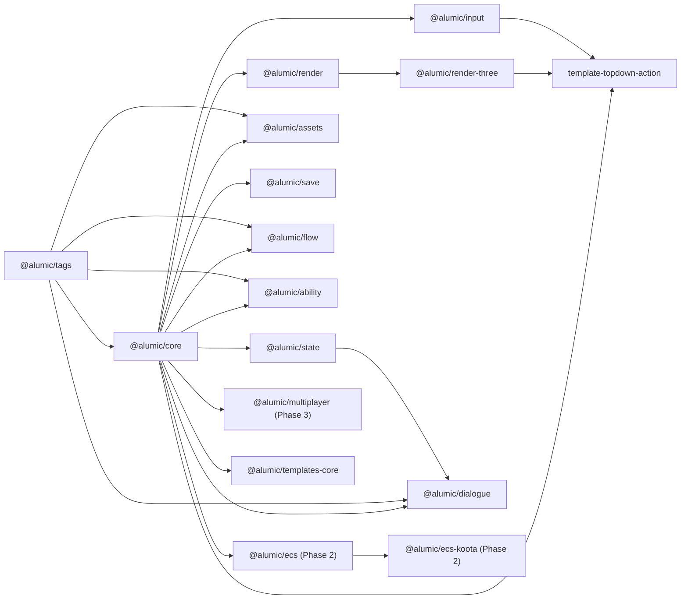

<Info>
**Decisions shaping this page:** [ADR-011 Disposable is a bare cleanup function](/decisions/011-disposable-shape), [ADR-021 Templates and plugins distributed via Alumic marketplace (Phase 4)](/decisions/021-marketplace-phase-4), [ADR-035 CLI is SaaS-aware by default](/decisions/035-cli-saas-aware), [ADR-048 Template install seeds entities and rewrites refs server-side](/decisions/048-template-install-seed)
</Info>

## Core Types

Two types are used across the kernel and should be understood before reading further:

```typescript
/**
 * A cleanup function returned by any API that allocates a handle —
 * schedule(), subscribe(), plugin.build(), ctx.entities.register*(), etc.
 * Calling it releases whatever the API allocated. Idempotent.
 * See [ADR-011 Disposable is a bare cleanup function](/decisions/011-disposable-shape).
 */
export type Disposable = () => void;

/**
 * Four lifecycle scopes. See [Subsystem Hierarchy](/reference/subsystem-hierarchy)-subsystem-hierarchy.md.
 */
export type Scope = 'App' | 'Session' | 'Scene' | 'Player';
```

## The Minimal Kernel

Alumic's kernel is ~300 lines of TypeScript. It provides five load-bearing primitives that every plugin, subsystem, and system builds upon. The kernel never grows — new capabilities are added via plugins, not by expanding the kernel.

```
┌─────────────────────────────────────────────────────────────────┐
│                              App                                │
│                                                                 │
│  ┌──────────────┐  ┌──────────────┐  ┌──────────────┐           │
│  │   Plugin     │  │  Subsystem   │  │    Event     │           │
│  │  Registry    │  │  Hierarchy   │  │     Bus      │           │
│  │              │  │              │  │              │           │
│  │ sort → build │  │ App → Sess   │  │ Observable<T>│           │
│  │              │  │ → Scene      │  │ + Tag-based  │                │
│  │              │  │ → Player     │  │   dispatch   │                │
│  └──────────────┘  └──────────────┘  └──────────────┘                │
│                                                                       │
│  ┌──────────────┐  ┌──────────────┐                                  │
│  │    Tag       │  │  Three-Phase │                                  │
│  │  Registry    │  │  Scheduler   │                                  │
│  │              │  │              │                                  │
│  │ Hierarchical │  │ PreUpdate    │                                  │
│  │ dotted tags  │  │ Update       │                                  │
│  │ + redirects  │  │ PostUpdate   │                                  │
│  └──────────────┘  └──────────────┘                                  │
│                                                                       │
└──────────────────────────────────────────────────────────────────────┘
```

### 1. Plugin Registry

The registry holds all installed `AlumicPlugin` instances. During `App.boot()`, it:
1. Collects all plugins added via the `App` constructor
2. Topologically sorts them by declared `dependencies`
3. Calls `build(ctx)` on each in dependency order
4. Stores the `Disposable` returned by each `build()` for cleanup during `shutdown()`

Late-binding is supported: a plugin can be added before its dependencies are registered. The sort happens at boot time, not at registration time.

### 2. Subsystem Hierarchy

Subsystems are scoped singletons. Four scopes exist, each with its own lifecycle:

| Scope | Lifetime | Example Use |
|-------|----------|-------------|
| `App` | Entire process | Audio engine, asset cache, render kernel |
| `Session` | One play-through / save file | Player profile, game settings, world state |
| `Scene` | Active level / screen | Physics world, AI manager, spawner |
| `Player` | Per-local-player | Input bindings, camera, HUD state |

Subsystems are defined via `defineSubsystem<T>(scope, build)`. The `build` function returns a `SubsystemConfig<T>` with `init()`, optional `deinit()`, and optional `tick()`. The kernel calls `init()` when the scope is entered and `deinit()` when it exits. Subsystems with `tick()` are automatically registered with the scheduler.

Subsystems reference each other through the `AppContext.get()` method, not through direct imports. This enables late-binding: a subsystem can request another subsystem that was registered by a different plugin, as long as that plugin's `build()` ran first (guaranteed by dependency sorting).

### 3. Typed Event Bus

The event bus provides typed, tag-addressed publish/subscribe communication. Channels are defined statically via `defineChannel<T>(tag)` and can be imported by any package.

```typescript
// Defined in @alumic/combat
export const DamageDealt = defineChannel<{ target: string; amount: number }>('Combat.Damage.Dealt');

// Used in @alumic/ui
DamageDealt.on((e) => showDamageNumber(e.target, e.amount));

// Used in @alumic/health
DamageDealt.on((e) => applyDamage(e.target, e.amount));
```

The bus is **synchronous** — events are dispatched inline during the current frame. This ensures predictable ordering: events emitted during PreUpdate are fully processed before Update begins.

The bus integrates with the tag registry for **hierarchical dispatch**: subscribing to `'Combat'` catches events on `'Combat.Damage.Dealt'`, `'Combat.Damage.Blocked'`, etc.

### 4. Tag Registry

Tags are hierarchical, dot-separated identifiers used throughout Alumic:
- Event channels are addressed by tags
- Abilities check required/blocked tags for activation
- Assets are organized by tags for bundle loading
- Templates can query available systems by tag

Tags are defined via `defineTag(path)` and registered in a global `TagRegistry`. The registry supports:
- Hierarchical matching (`'Ability.Fire'` matches `'Ability.Fire.Ranged'`)
- Redirectors (alias `'Dmg'` → `'Combat.Damage.Dealt'`)
- Querying all tags under a prefix

### 5. Three-Phase Scheduler

The scheduler runs all registered systems in three phases each tick:

1. **PreUpdate** — Input polling, network receive, animation sampling, render `beginFrame()`
2. **Update** — Game logic, physics step, AI decisions, state machine transitions
3. **PostUpdate** — Cleanup, render `render()`, state snapshotting

Systems within the same phase execute in insertion order (determined by plugin composition order). The scheduler provides `TickContext` to each system: `{ dt, elapsed, frame }`.

## Package Dependency Graph



Key design constraints:
- `@alumic/tags` has zero Alumic dependencies — it can be used standalone
- `@alumic/core` depends only on `@alumic/tags`
- `@alumic/render` is interface-only; implementations (`render-three`) are separate packages
- Feature plugins depend on `core` and `tags` but not on each other (unless explicitly declared)
- Templates depend on the specific plugins they compose

## Composition Model

The composition flows downward through three layers:

### Layer 1: Kernel (App + 5 primitives)
Provides the composition machinery. Never imported by end users directly — they interact with it through plugins and templates.

### Layer 2: Plugins (@alumic/* packages)
Each plugin implements the `AlumicPlugin` interface. During `build(ctx)`, a plugin:
- Registers subsystems via `ctx.subsystem(handle)`
- Subscribes to event channels via `Channel.on(handler)`
- Schedules systems via `ctx.schedule(phase, fn)`
- Provides services via `ctx` for other plugins to consume

Plugins are the unit of reuse. A dialogue system, an inventory system, a combat system — each is a plugin.

### Layer 3: Templates (game starters)
A template is a `defineTemplate()` call that lists which plugins to compose, which subsystems to activate, which scenes to load, and an entry point function. Templates ship as marketplace items ([ADR-021 Templates and plugins distributed via Alumic marketplace (Phase 4)](/decisions/021-marketplace-phase-4)); the CLI ([ADR-035 CLI is SaaS-aware by default](/decisions/035-cli-saas-aware)) installs one into a SaaS project (browser-first) or a local workspace (`--offline`). First-party templates also live as Bun workspace packages in `templates/` for development.

```typescript
export default defineTemplate({
  name: 'topdown-action',
  plugins: [
    threeWebGL(),
    input(),
    state(),
    ability(),
  ],
  subsystems: [CombatSubsystem, SpawnerSubsystem],
  // Scene map — template-local key → seed-entity ID. The template installer
  // ([ADR-048 Template install seeds entities and rewrites refs server-side](/decisions/048-template-install-seed)) rewrites the values to the cloned-project entity IDs at install
  // time. Game code calls `app.pushScene('main')`; the loader resolves the key
  // through this map and fetches the Scene entity via the entity database
  // ([Entity Graph](/reference/entity-graph)). Canonical signature lives in spec 17.
  scenes: {
    'main': 'scene:main',
  },
  entry: async (app) => app.pushScene('main'),
});
```

## Cross-Cutting Concerns

### Type Safety
All `define*` factories use TypeScript generics to propagate types. `defineChannel<T>` types the event payload. `defineSubsystem<T>` types the subsystem state. `defineComponent<S>` (ECS, Phase 2) types the component data. No `any`, no type assertions in public APIs.

### Lifecycle Management
The kernel owns all lifecycle transitions. Plugins never call `new` on subsystems directly — they declare what should exist at each scope, and the kernel handles instantiation, ordering, and teardown. This prevents resource leaks and ordering bugs.

### Error Boundaries
Errors in one plugin's `build()` or one system's `tick()` must not crash the entire app. The kernel wraps each call in a try-catch and reports errors through a logging channel. In development mode, errors are surfaced in the SolidJS debug panel. In production, they are logged and the offending system is disabled.

### Hot Module Replacement (Future)
The `AlumicPlugin` interface includes an optional `swap(ctx, old)` method. When a plugin is hot-reloaded, the kernel calls `swap()` on the new instance, passing the old instance so it can migrate state. This enables live-editing of game systems without reloading the page. Full implementation is deferred to Phase 4 (Editor).
