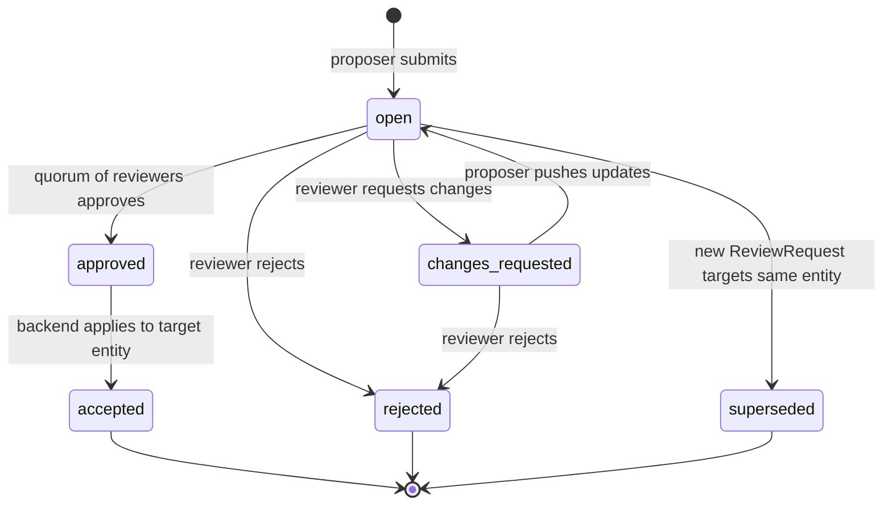

<Info>
**Decisions shaping this page:** [ADR-043 Project-management entity types land Phase 3; automation Phase 4](/decisions/043-project-management-phase-3), [ADR-042 Proposed writes and approval gates](/decisions/042-proposed-writes-approvals), [ADR-027 Engine-plugin sync is snapshot + event-stream, server-authoritative](/decisions/027-engine-plugin-sync-protocol), [ADR-041 Actor model: users and agents as peers](/decisions/041-actor-model), [ADR-018 Entity-type and extractor registration via ctx.entities](/decisions/018-entity-registration-api)
</Info>

## Overview

Project management is a native layer in Alumic, not an integration. Issues, boards, sprints, milestones, and comments are first-class entities ([Entity Graph](/reference/entity-graph)). Their references into authored content — a bug ticket pointing at a specific `Dialogue`, a design-decision issue pointing at a `Character` and a `Scene` — reuse the standard `EntityRef` mechanism, so backlinks, navigation, and integrity are free.

This chapter covers the PM entity types, editor surfaces, events, and phasing. Actors (human + agent), approvals, and automation live in [Actors and Agents](/reference/actors-and-agents).

See [ADR-043 Project-management entity types land Phase 3; automation Phase 4](/decisions/043-project-management-phase-3) for the scope decision and [ADR-042 Proposed writes and approval gates](/decisions/042-proposed-writes-approvals) for the approval primitive PM entities build on.

## Design Principles

1. **Issues are entities.** No separate PM database, no separate API. An Issue lives in Postgres next to the Dialogue it references, carries a `version`, has backlinks, gets synced over the same event stream ([ADR-027 Engine-plugin sync is snapshot + event-stream, server-authoritative](/decisions/027-engine-plugin-sync-protocol)).
2. **Flat work items with a `kind` field.** Linear-style. No Epic→Story→Task hierarchy. `kind` is workspace-configurable so agent-native kinds (`agent-run`, `agent-proposed-change`) coexist with familiar ones (`task`, `bug`, `feature`).
3. **Boards are saved queries.** A `Board` holds column definitions plus a filter; membership is derived, not enumerated. Moving an Issue between columns updates its `status`, which re-evaluates against all boards.
4. **Comments are universal.** A `Comment` targets any entity, not just Issues. The Inspector's Comments drawer appears on every entity type.
5. **Every PM action carries an Actor.** Humans and agents alike ([ADR-041 Actor model: users and agents as peers](/decisions/041-actor-model)). Agent-created Issues are first-class; an issue kind `agent-run` surfaces automation and LLM work for review.

## Built-In Entity Types

Registered via `ctx.entities.registerType()` during `@alumic/pm` plugin build.

### Issue

```typescript
import { z } from 'zod';

export const IssueStatusSchema = z.object({
  columnId: z.string(),               // which board column this resolves to
  name: z.string(),                   // 'todo' | 'in-progress' | 'review' | 'done' | workspace-configurable
});

export const IssueSchema = z.object({
  title: z.string().min(1).max(256),
  body: z.string(),                   // markdown
  kind: z.string(),                   // workspace-configurable; defaults include
                                      //   'task' | 'bug' | 'feature' | 'chore' | 'decision'
                                      //   | 'agent-run' | 'agent-proposed-change'
  status: IssueStatusSchema,
  priority: z.enum(['urgent', 'high', 'normal', 'low']).default('normal'),

  // Actor refs (see [ADR-041 Actor model: users and agents as peers](/decisions/041-actor-model) — Actor resolves to User or Agent)
  assignee: z.string().optional(),    // actor_id
  reporter: z.string(),               // actor_id of the creator

  // Containment refs (optional; denormalized for fast board queries)
  sprintId: z.string().optional(),
  milestoneId: z.string().optional(),
  boardId: z.string().optional(),

  // Free-form references into the entity graph. The extractor (below) emits
  // these as EntityRef rows.
  entityRefs: z.array(z.object({
    role: z.string(),                 // e.g. 'affects', 'blocks', 'relates-to'
    targetId: z.string(),
    targetType: z.string(),
    context: z.string().optional(),
  })).default([]),

  // Approval state for kinds like 'decision' and 'review' ([ADR-042 Proposed writes and approval gates](/decisions/042-proposed-writes-approvals) issue-level approvals)
  approval: z.object({
    state: z.enum(['open', 'needs-review', 'changes-requested', 'approved', 'rejected']),
    requiredApprovals: z.number().int().min(1).default(1),
    approvals: z.array(z.object({
      actorId: z.string(),
      decision: z.enum(['approve', 'request-changes', 'reject']),
      comment: z.string().optional(),
      at: z.string(),                 // ISO timestamp
    })).default([]),
  }).optional(),

  // Agent attribution — set when an agent created the issue or when it tracks an AgentRun
  originAgentRunId: z.string().optional(),

  // Linked ReviewRequest (proposal from [ADR-042 Proposed writes and approval gates](/decisions/042-proposed-writes-approvals)), when this Issue tracks one
  reviewRequestId: z.string().optional(),

  labels: z.array(z.string()).default([]),
  dueDate: z.string().optional(),
  estimatedHours: z.number().optional(),
});

export const IssueType = defineEntityType({
  name: 'Issue',
  icon: 'circle-dot',
  editor: 'spec-sheet',               // with Comments drawer + References panel
  schema: IssueSchema,
  defaults: {
    body: '',
    status: { columnId: 'todo', name: 'Todo' },
    priority: 'normal',
    labels: [],
    entityRefs: [],
  },
});
```

### Board

```typescript
export const BoardSchema = z.object({
  displayName: z.string(),
  description: z.string().optional(),
  columns: z.array(z.object({
    id: z.string(),
    name: z.string(),
    wipLimit: z.number().int().positive().optional(),
    // Map board column → Issue.status.columnId. An Issue is 'on' this board
    // if its current status.columnId appears in columns.
  })).min(1),
  lanes: z.array(z.object({
    id: z.string(),
    name: z.string(),
    filter: z.string().optional(),    // e.g. "priority == 'urgent'" or "assignee == 'actor-id'"
  })).optional(),
  // Board-level filter (scopes which Issues show up at all).
  filter: z.string().optional(),       // e.g. "sprintId == 'current'" or "kind == 'bug'"
  sortBy: z.enum(['priority', 'createdAt', 'updatedAt', 'manual']).default('manual'),
  tags: z.array(z.string()).optional(),
});

export const BoardType = defineEntityType({
  name: 'Board',
  icon: 'columns',
  editor: 'board',                    // NEW editor surface
  schema: BoardSchema,
  defaults: {
    columns: [
      { id: 'todo', name: 'Todo' },
      { id: 'in-progress', name: 'In Progress' },
      { id: 'review', name: 'Review' },
      { id: 'done', name: 'Done' },
    ],
    sortBy: 'manual',
  },
});
```

### Sprint

```typescript
export const SprintSchema = z.object({
  displayName: z.string(),
  goal: z.string().optional(),
  startsAt: z.string(),               // ISO date
  endsAt: z.string(),
  boardId: z.string().optional(),     // optional pairing with a kanban
  capacity: z.number().optional(),    // hours or points; workspace-configurable unit
  state: z.enum(['planned', 'active', 'completed']).default('planned'),
});

export const SprintType = defineEntityType({
  name: 'Sprint',
  icon: 'calendar-range',
  editor: 'sprint-backlog',           // NEW editor surface
  schema: SprintSchema,
});
```

### Milestone

```typescript
export const MilestoneSchema = z.object({
  displayName: z.string(),
  description: z.string().optional(),
  dueDate: z.string(),                // ISO date
  state: z.enum(['open', 'achieved', 'abandoned']).default('open'),
});

export const MilestoneType = defineEntityType({
  name: 'Milestone',
  icon: 'flag',
  editor: 'milestone-timeline',       // NEW editor surface (read-only Gantt-ish)
  schema: MilestoneSchema,
});
```

### Comment

```typescript
export const CommentSchema = z.object({
  authorActorId: z.string(),          // [ADR-041 Actor model: users and agents as peers](/decisions/041-actor-model) actor
  targetEntityId: z.string(),         // can be any entity, not just Issues
  threadId: z.string().optional(),    // null = top-level; else another comment's ID
  body: z.string(),                   // markdown
  createdAt: z.string(),              // server-stamped
  editedAt: z.string().optional(),
  // Mentions extracted by the ref extractor:
  mentionedActorIds: z.array(z.string()).default([]),
  mentionedEntityIds: z.array(z.string()).default([]),
});

export const CommentType = defineEntityType({
  name: 'Comment',
  icon: 'message-square',
  editor: 'spec-sheet',               // rarely opened directly; shown inline on target entity
  schema: CommentSchema,
});
```

### ReviewRequest

A thin entity wrapping an `entity_proposals` row ([ADR-042 Proposed writes and approval gates](/decisions/042-proposed-writes-approvals)) so proposals appear in the entity browser, can be assigned to reviewers, and can be linked from Issues.

The proposal lifecycle:




```typescript
export const ReviewRequestSchema = z.object({
  proposalId: z.string(),             // FK into entity_proposals
  targetEntityId: z.string(),
  targetEntityType: z.string(),
  summary: z.string(),
  proposerActorId: z.string(),
  agentRunId: z.string().optional(),
  requestedReviewers: z.array(z.string()).default([]),  // actor_ids
  state: z.enum(['open', 'approved', 'changes-requested', 'rejected', 'superseded']),
  createdAt: z.string(),
  resolvedAt: z.string().optional(),
});

export const ReviewRequestType = defineEntityType({
  name: 'ReviewRequest',
  icon: 'git-pull-request',
  editor: 'spec-sheet',
  schema: ReviewRequestSchema,
});
```

## Reference Extractors

Each PM entity type ships an extractor that emits `EntityRef` rows the standard way (spec/23):

- `Issue` → refs for every `entityRefs[].{role, targetId, targetType}`, plus `assignee` (role `assignedTo`, targetType `Actor`), `reporter`, `sprintId` (role `inSprint`), `milestoneId` (role `inMilestone`), `reviewRequestId` (role `reviews`).
- `Comment` → refs for `targetEntityId` (role `commentOn`), `mentionedEntityIds[]` (role `mentions`), `mentionedActorIds[]` (role `mentionsActor`).
- `Board` → no content refs; filter referenced entities resolve at query time, not at write time.
- `Sprint` → ref for `boardId` (role `onBoard`).
- `ReviewRequest` → ref for `targetEntityId` (role `proposes`).

Backlinks (spec/23:398) then answer: "which Issues reference Character *old-hermit*?", "who has mentioned me in comments?", "which Sprints target this Board?" — all without special-case code.

## Editor Surfaces

Three new editor surfaces register via `ctx.editors.register()` ([ADR-018 Entity-type and extractor registration via ctx.entities](/decisions/018-entity-registration-api)). Issue opens in the existing `spec-sheet` with two new Inspector panes (Comments and a Linked ReviewRequest badge).

### `board` — Kanban

```
┌──────────────────────────────────────────────────────────────────┐
│ Q2 Narrative                                        [⋯] [+ Issue]│
├─────────┬─────────────────┬──────────────┬─────────────┬─────────┤
│ Todo (4)│ In Progress (2) │ Review (1)   │ Done (13)   │         │
├─────────┼─────────────────┼──────────────┼─────────────┼─────────┤
│ □ Fix…  │ □ Write shop-   │ ◇ Approve   │ ☑ Intro cut │         │
│ □ Add…  │   intro dialog  │   auto-lint…│ ☑ …         │         │
│         │ □ Playtest beat │             │             │         │
└─────────┴─────────────────┴──────────────┴─────────────┴─────────┘
```

Behaviors:
- Drag an Issue between columns → updates `Issue.status.columnId` via a standard PATCH with `If-Match`.
- WIP limits surface as a column warning; no hard block (some flows need to exceed).
- Swimlanes partition rows by the `Board.lanes[].filter` (e.g., one lane per assignee).
- `[+ Issue]` opens the Issue creation form pre-filled with `boardId` and `status.columnId`.
- A diamond (◇) icon on cards with an open `ReviewRequest` indicates approval pending.

### `sprint-backlog` — Sprint View

A two-pane layout: backlog (issues with no sprint) on the left, sprint contents on the right. Drag to plan. Sprint state transitions (`planned → active → completed`) surface ceremony actions: "Start Sprint", "Complete Sprint".

On "Complete Sprint": unfinished issues prompt for "Roll over to next sprint", "Move to backlog", or "Close as won't-fix".

### `milestone-timeline` — Timeline (read-only)

Horizontal Gantt of milestones with their due dates. Clicking a milestone shows its issues grouped by status. No dragging; date edits happen in the Milestone spec-sheet.

### Spec-Sheet Inspector extensions

For Issue, Comment, and any entity that accepts comments:

- **Properties** pane (existing).
- **References** pane (existing — the `entityRefs`).
- **Used By** pane (existing — backlinks).
- **Comments drawer** (NEW) — threaded comments targeting this entity. `@-mention` autocomplete for entities and actors.
- **Linked ReviewRequest badge** (Issue only) — inline approve/request-changes controls if the viewer is a designated reviewer.

## Event Channels

Follow the `spec/06` dot-hierarchy convention. All synchronous, all routed through the event bus + sync stream.

```typescript
export const IssueCreated        = defineChannel<{ issueId: string; reporterActorId: string; boardId?: string }>('PM.Issue.Created');
export const IssueUpdated        = defineChannel<{ issueId: string; changes: string[] }>('PM.Issue.Updated');
export const IssueStatusChanged  = defineChannel<{ issueId: string; from: string; to: string; actorId: string }>('PM.Issue.StatusChanged');
export const IssueAssigned       = defineChannel<{ issueId: string; assigneeActorId: string; byActorId: string }>('PM.Issue.Assigned');
export const IssueCommented      = defineChannel<{ issueId: string; commentId: string; authorActorId: string }>('PM.Issue.Commented');

export const BoardUpdated        = defineChannel<{ boardId: string }>('PM.Board.Updated');

export const SprintStarted       = defineChannel<{ sprintId: string; startsAt: string; endsAt: string }>('PM.Sprint.Started');
export const SprintCompleted     = defineChannel<{ sprintId: string; rolledOverIssueIds: string[] }>('PM.Sprint.Completed');

export const MilestoneAchieved   = defineChannel<{ milestoneId: string; achievedAt: string }>('PM.Milestone.Achieved');

// Approvals ([ADR-042 Proposed writes and approval gates](/decisions/042-proposed-writes-approvals) issue-level; proposal-level events are on 'Proposal.*' — see spec/19)
export const IssueApprovalRequested = defineChannel<{ issueId: string; reviewerActorIds: string[] }>('PM.Issue.Approval.Requested');
export const IssueApproved          = defineChannel<{ issueId: string; byActorId: string }>('PM.Issue.Approved');
export const IssueChangesRequested  = defineChannel<{ issueId: string; byActorId: string; comment?: string }>('PM.Issue.ChangesRequested');
```

## Role Matrix (extends spec/26)

| Operation | Required role |
|---|---|
| `GET /api/projects/:pid/entities?type=Issue` | `viewer` |
| `POST /api/projects/:pid/entities` (Issue) | `editor` |
| `PATCH /api/projects/:pid/entities/:id` (Issue, Board, Sprint, Milestone) | `editor` |
| Change `Issue.status` | `editor`; self-assign allowed for `viewer` on their own assigned issues |
| Comment on any entity | `viewer` (any member) |
| Create `Board`, `Sprint`, `Milestone` | `editor` |
| Configure workspace-level `kind` enum | workspace `owner` |
| Approve an `Issue.approval` | role assigned as reviewer; defaults to `editor` |
| Approve a `ReviewRequest` | per [ADR-042 Proposed writes and approval gates](/decisions/042-proposed-writes-approvals) policy |
| Create / revoke `Agent` | workspace `owner` |

## Phasing

Mirrors [ADR-043 Project-management entity types land Phase 3; automation Phase 4](/decisions/043-project-management-phase-3):

| Feature | Phase |
|---|---|
| Issue, Board, Sprint, Milestone, Comment entity types | 3 |
| `board`, `sprint-backlog`, `milestone-timeline` editor surfaces | 3 |
| Role enforcement on PM entities | 3 |
| Comments drawer on every entity | 3 |
| ReviewRequest + proposed writes ([ADR-042 Proposed writes and approval gates](/decisions/042-proposed-writes-approvals) basic) | 3 |
| Issue-level approval state machine | 3 |
| Approval policy editor UI ([ADR-042 Proposed writes and approval gates](/decisions/042-proposed-writes-approvals)) | 4 |
| Velocity metrics, burndown | 4 |
| `AutomationRule` (spec/28) | 4 |
| Agent-run dashboards | 4 |
| Cross-project dependencies, SLA tracking | 5+ |

## Examples

### Agent opens a bug with an entity reference

```
actor: agent "auto-linter" (on_behalf_of_user_id = studio-lead)
POST /api/projects/:pid/entities  kind=Issue
{
  title: "Missing lineId in shop-intro dialogue",
  body: "Node `greet-001` references `shop.greet.001` which is not in strings table.",
  kind: "bug",
  status: { columnId: "todo", name: "Todo" },
  priority: "high",
  reporter: "agent:auto-linter",
  entityRefs: [
    { role: "affects", targetId: "shop-intro", targetType: "Dialogue" },
    { role: "affects", targetId: "shop-strings", targetType: "StringTable" }
  ],
  originAgentRunId: "018f-run-..."
}
```

The inspector's "Used By" on `shop-intro` now shows the Issue as a backlink. An editor triages, perhaps converts the Issue into a linked ReviewRequest where the agent's proposed fix awaits approval.

### Sprint ceremony

```
POST   /api/projects/:pid/entities                                   # kind=Sprint, state='planned'
PATCH  /api/projects/:pid/entities/:issue-1     {sprintId: 'sprint-Q2-w1'}  # assign 8 issues
PATCH  /api/projects/:pid/entities/:sprint      {state: 'active'}  # → PM.Sprint.Started
  ... week of work ...
PATCH  /api/projects/:pid/entities/:sprint      {state: 'completed'}
  # server auto-emits PM.Sprint.Completed with rolledOverIssueIds
```

## Not in This Chapter

- Actor identity, agent registration, agent credentials: [Actors and Agents](/reference/actors-and-agents).
- Proposed-write protocol and approval policies: `adr/042-proposed-writes-approvals.md`.
- Schema API surface details: [Entity API](/reference/entity-api).
