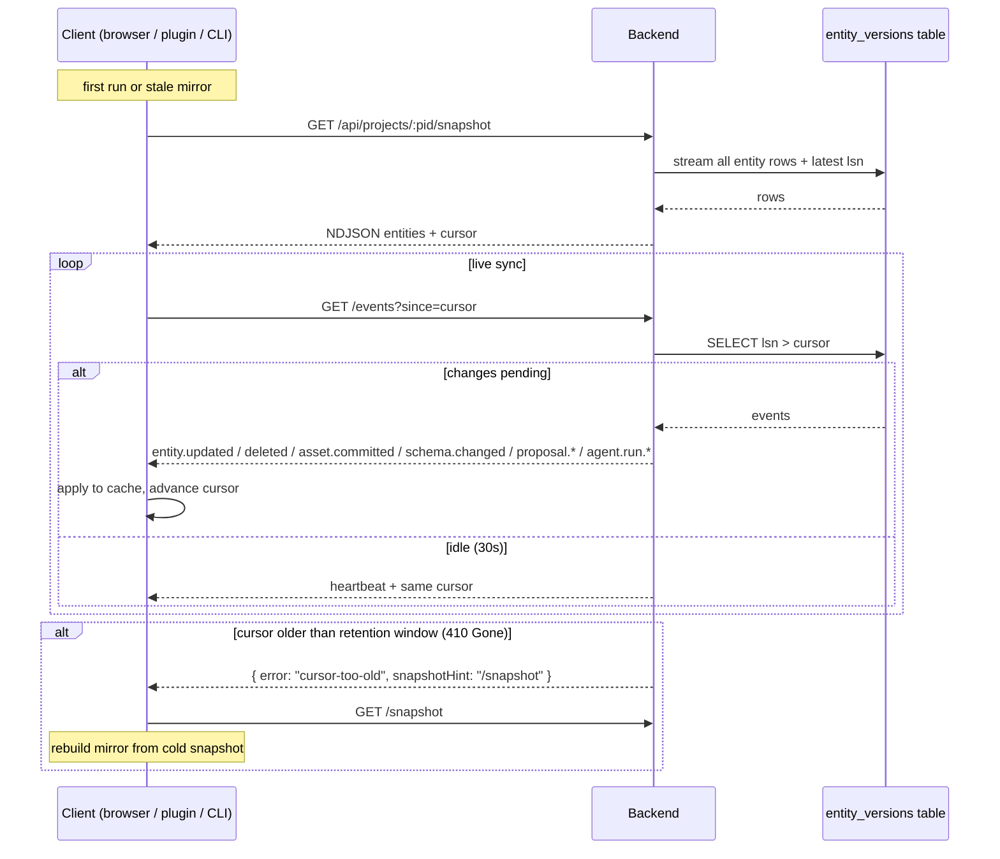

<Info>
**Decisions shaping this page:** [ADR-027 Engine-plugin sync is snapshot + event-stream, server-authoritative](/decisions/027-engine-plugin-sync-protocol), [ADR-031 Offline and reconnect semantics per client](/decisions/031-offline-and-reconnect)
</Info>

## Live Sync

Two transports, same cursor:

- **Long poll:** `GET /api/projects/:pid/events?since=<cursor>` — returns up to N events or waits up to 30s for new ones. Good for proxies that strip SSE; the engine plugin's default.
- **SSE:** `GET /api/projects/:pid/events?stream=sse` — continuous stream. Browser's default ([ADR-027 Engine-plugin sync is snapshot + event-stream, server-authoritative](/decisions/027-engine-plugin-sync-protocol)).



Event payloads:

```
event: entity.updated
data: { "entityId": "old-hermit", "type": "Character", "version": 17, "cursor": "018f..." }

event: entity.deleted
data: { "entityId": "orphan-1", "cursor": "018f..." }

event: asset.committed
data: { "assetId": "018f...", "sha256": "...", "cursor": "018f..." }

event: schema.changed
data: { "schemaVersion": "2026-04-21.1", "cursor": "018f..." }

event: proposal.submitted
data: { "proposalId": "018f...", "entityId": "old-hermit", "summary": "Fix missing bio", "proposerActorId": "agent:auto-editor", "agentRunId": "018f...", "cursor": "018f..." }

event: proposal.reviewed
data: { "proposalId": "018f...", "decision": "approve", "reviewerActorId": "01HR...", "cursor": "018f..." }

event: proposal.accepted
data: { "proposalId": "018f...", "entityId": "old-hermit", "newVersion": 9, "cursor": "018f..." }

event: proposal.rejected
data: { "proposalId": "018f...", "cursor": "018f..." }

event: agent.run.started
data: { "runId": "018f...", "agentId": "018f...", "cursor": "018f..." }

event: agent.run.closed
data: { "runId": "018f...", "status": "succeeded", "writeCount": 12, "cursor": "018f..." }
```

Clients persist the last-seen `cursor` and resume with `?since=<cursor>` after any interruption ([ADR-031 Offline and reconnect semantics per client](/decisions/031-offline-and-reconnect)).
